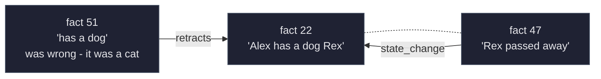
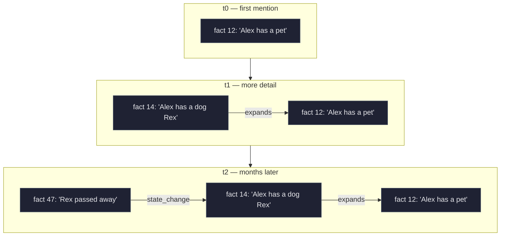

# manila

A long-term memory layer for personal chat. Reads messages from your WhatsApp, extracts durable facts about the people in your life, and stores them as an **append-only graph** of facts, typed connections, and topical threads. Query through a small web UI with RAG-backed chat or programmatically via the engine's TypeScript API.

> **WhatsApp ban risk.** Live ingest uses [`whatsapp-web.js`](https://github.com/pedroslopez/whatsapp-web.js), which drives the Web client through Puppeteer and is not an official API. Personal accounts have been banned for less. Use at your own risk; do not run on an account you can't afford to lose. The chat-export importer doesn't hit WhatsApp servers and carries no such risk.

---

## Mental model

Three ideas underpin the system. Get these and the rest of the code reads naturally.

### 1. Memory is *per subject*, not per user

The store is keyed by **subject** — `me`, `alex`, `mom`, `riley`, … — not by a single "user id". Every fact says one thing about *one* person. A chat with Alex generates facts about Alex (her job, her dog, her habits), about *me* (what I told her, what I'm doing), and about anyone else mentioned (Sam, Mom, the dog). All of them are first-class subjects, queryable independently.

The chat is a *source*, not the unit of memory. The engine doesn't care whether facts came from WhatsApp, a chat export, or a hand-typed CLI — anything that can produce `(contact, message, timestamp, direction)` tuples can feed it.

### 2. Facts are *immutable*. All change is additive

Once a fact is written, it's never modified or deleted. New information about an existing fact lands as a **new fact** plus a typed **connection** between them.



Both rows stay active. The connection captures *how* they relate. The closed predicate set:

| Predicate | Meaning | Example |
|---|---|---|
| `update`       | Same thing, new state                       | `lives in Berlin` → `lives in Lisbon` |
| `state_change` | Discrete event changed state                | `has a dog Rex` → `Rex passed away` |
| `expands`      | Same fact, more specific                    | `has a pet` → `has a dog Rex` |
| `qualifies`    | Adds a condition or nuance                  | `works at the bank` → `works part-time at the bank` |
| `contradicts`  | Mutual exclusion, no resolution             | `lives in Rome` ↔ `lives in Milan` |
| `retracts`     | Old fact was wrong (extractor hallucination)| `has a cat` → `actually a dog` |
| `same_as`      | Restating, deduped                          | two extractions of the same event |

This buys three things: **history preservation** (we can answer "did Alex have a dog last March?"), **honest semantics** (an `update` is meaningfully different from a `retracts`), and a **safer curator** — the agent can only add edges, never destroy facts.

### 3. Facts live inside *threads*

A thread is a topical bucket per subject — `Rex (her dog)`, `career`, `music tastes`, `travel — Italy 2026`. Threads are not the same as the fact's structural category (`preference`/`event`/`fact`/`commitment`/`relationship`); they're free-form, LLM-named, and a fact can belong to many threads at once.

When new facts arrive, the pipeline runs one extra LLM call per subject to either attach them to existing threads or propose new ones. The result: memory is browsable as `<subject> → <thread> → <fact>` rather than as a flat list.

---

## The data model

Schema lives in [`src/engine/storage/schema.sql`](src/engine/storage/schema.sql). SQLite + WAL + `sqlite-vec` for embeddings. The deep technical reference is [`src/engine/README.md`](src/engine/README.md); below are the four tables that anchor the mental model.

### `facts` — the atomic unit

```sql
CREATE TABLE facts (
  id                INTEGER PRIMARY KEY,
  source_msg_id     INTEGER REFERENCES raw_messages(id),
  source_burst_id   INTEGER REFERENCES conversation_bursts(id),
  subject_wa_id     TEXT NOT NULL,        -- 'me' | wa_id | name
  category          TEXT NOT NULL,        -- preference|event|commitment|fact|relationship
  content           TEXT NOT NULL,
  confidence        REAL NOT NULL DEFAULT 1.0,
  extracted_at      INTEGER NOT NULL,
  event_ts          INTEGER,              -- Unix s for time-anchored events; NULL otherwise

  -- Legacy. Pre-redesign rows could be superseded or soft-deleted; new rows
  -- never touch these. Retrieval still filters on them for back-compat.
  superseded_by_id  INTEGER REFERENCES facts(id),
  deleted_at        INTEGER
);
```

Every row is a self-contained sentence about one subject. Source provenance is tracked in a separate many-to-many `fact_sources` table because one fact can be backed by multiple bursts/messages over time (more sources → higher importance score in retrieval).

### `fact_connections` — typed edges between facts

```sql
CREATE TABLE fact_connections (
  id                       INTEGER PRIMARY KEY,
  from_fact_id             INTEGER NOT NULL REFERENCES facts(id) ON DELETE CASCADE,
  to_fact_id               INTEGER NOT NULL REFERENCES facts(id) ON DELETE CASCADE,
  predicate                TEXT NOT NULL CHECK (predicate IN (
    'update', 'state_change', 'expands', 'qualifies',
    'contradicts', 'retracts', 'same_as'
  )),
  confidence               REAL NOT NULL DEFAULT 1.0,
  reason                   TEXT,
  source_agent_action_id   INTEGER REFERENCES agent_actions(id),
  created_at               INTEGER NOT NULL,
  -- Re-asserting the same edge is idempotent
  UNIQUE(from_fact_id, to_fact_id, predicate)
);
```

The closed predicate enum is enforced at the SQL `CHECK` level — the engine cannot invent new edge types. `latestInChain(factId)` walks `update` and `state_change` edges to the leaf, returning the most recent fact in the chain (or the original if there's a fork — contradictions are surfaced, not silently flattened).

### `memory_threads` — topical buckets

```sql
CREATE TABLE memory_threads (
  id                    INTEGER PRIMARY KEY,
  name                  TEXT NOT NULL,        -- "career", "Rex (her dog)", "music tastes"
  description           TEXT,
  owner_subject_wa_id   TEXT,                 -- nullable: cross-subject threads OK
  created_at            INTEGER NOT NULL,
  updated_at            INTEGER NOT NULL,
  deleted_at            INTEGER,              -- soft-delete reserved for thread merge
  UNIQUE(owner_subject_wa_id, name)
);

CREATE TABLE fact_thread_membership (
  fact_id                  INTEGER NOT NULL REFERENCES facts(id) ON DELETE CASCADE,
  thread_id                INTEGER NOT NULL REFERENCES memory_threads(id) ON DELETE CASCADE,
  attached_at              INTEGER NOT NULL,
  source_agent_action_id   INTEGER REFERENCES agent_actions(id),
  PRIMARY KEY(fact_id, thread_id)
);
```

Many-to-many: a fact about Alex's sister's wedding can sit in both `Alex — family` and `Alex — events 2026`. Threads are mostly per-subject (`owner_subject_wa_id` set), but the column is nullable to allow cross-subject threads (`shared trips`, `wedding planning`) when those make sense.

### How a piece of memory ages

A typical sequence over weeks of conversation:



All three rows persist forever. A query at t2 can ask "did Alex ever have a dog?" (yes, fact 14), "what's the latest about Rex?" (`latestInChain(14)` → fact 47), or "what's Alex's pet history?" (walk the chain).

---

## Architecture in one paragraph

`sources/` (whatsapp live, chat-export) produce `raw_messages`. The engine groups contiguous messages into `conversation_bursts` (gap < 30 min). For each burst: an LLM filter decides whether the burst contains anything durable; an extract step pulls atomic facts; a guard drops rows about unnamed third parties; a per-subject consolidate step decides `ADD` (new fact) vs `CONNECT` (new fact + typed edge to an existing one) vs `DROP` (redundant). New facts are embedded (Cohere, 1024-dim) and persisted. A graph projection (`entities` + `knowledge_edges`) and per-subject **thread assignment** (one LLM call per subject per burst) run after the writes. A separate **curator agent** queues up when new info reframes an established entity; you drain it manually with `npm run curator-drain` and it proposes additional connections + thread organization that you can review and apply. Retrieval composes a `<memory>` XML block (preferences, ranked facts with citations, prose summaries, recent episodes) sized to a token budget, ready to drop into a chat agent's context.

[Full architecture + write/read paths + every table →](src/engine/README.md)

---

## Setup

```bash
npm install

cp .env.example .env
# set OPENROUTER_API_KEY, COHERE_API_KEY, and optionally OPENROUTER_MODEL

cp config/whitelist.example.json config/whitelist.json
# add the contacts you want to remember (wa_id like "393331234567@c.us")
```

**Requirements:** Node.js 20+, an OpenRouter API key, a Cohere API key (free tier is enough for personal use).

---

## Usage

```bash
# Live ingest. First run prints a QR code — scan with WhatsApp → Linked Devices.
npm run dev

# Backfill the last 30 days of whitelisted chats (run after live has authenticated).
npm run backfill

# One-off import of a WhatsApp "Export Chat" .txt file.
npm run import-chat -- --file path/to/_chat.txt --wa-id 393331234567@c.us --me "Your Name"

# Process queued bursts (filter → extract → consolidate → embed → threads). Idempotent.
ENABLE_GRAPH=1 npm run process

# Drain queued curator runs (entity-signal-triggered organization passes).
npm run curator-drain

# Web UI: chat (RAG), fact browser, threads, knowledge graph, chat-export uploader.
npm run web
# → http://localhost:3000

# Reset derived state (facts/embeddings/threads/graph) but keep raw_messages.
npm run reset-pipeline
```

---

## Storage & privacy

- `data/memory.db` — SQLite + `sqlite-vec`. Holds raw messages, bursts, facts, embeddings, connections, threads, the graph projection, agent runs, and the processing log. **Gitignored.**
- `data/session/` — `whatsapp-web.js` LocalAuth session (lets you skip the QR after the first scan). **Gitignored.**
- `config/whitelist.json` — your contacts. **Gitignored** by default.
- `.env` — API keys. **Gitignored.**

Whitelisted contacts only — anything not in `config/whitelist.json` is dropped at the source layer, before the engine sees it. Fact text is sent to OpenRouter (LLM) and Cohere (embeddings); message bodies stay in your local SQLite. No telemetry, no analytics.

---

## License

MIT. See [LICENSE](LICENSE).
