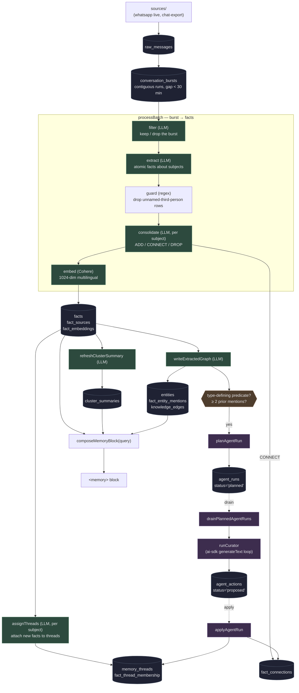

# Memory engine

A long-term, append-only memory layer for chat messages. Given a stream of
messages from one or more sources, it extracts durable, atomic facts about each
*person* in the conversation, organizes those facts into typed connections and
topical threads, and exposes them as a queryable memory.

This document is the canonical technical reference for how the engine works.
It's anchored in the code via `file:line` refs so it stays accurate as the code
evolves — if a section drifts, fix the doc.

## Contents

1. [Mental model](#1-mental-model)
2. [Architecture overview](#2-architecture-overview)
3. [Data model](#3-data-model)
   - 3.1 [Source data: `contacts`, `raw_messages`, `conversation_bursts`](#31-source-data)
   - 3.2 [Facts: `facts`, `fact_sources`, `fact_embeddings`](#32-facts)
   - 3.3 [Append-only structure: `memory_threads`, `fact_thread_membership`, `fact_connections`](#33-append-only-structure)
   - 3.4 [Knowledge graph: `entities`, `fact_entity_mentions`, `knowledge_edges`, `edge_sources`](#34-knowledge-graph)
   - 3.5 [Cluster summaries: `cluster_summaries`](#35-cluster-summaries)
   - 3.6 [Curator agent: `agent_runs`, `agent_actions`](#36-curator-agent)
   - 3.7 [Telemetry: `processing_log`](#37-telemetry)
4. [Write path: messages → facts](#4-write-path)
5. [Curator agent](#5-curator-agent)
6. [Read path: query → memory block](#6-read-path)
7. [Public API](#7-public-api)
8. [Boundary rule](#8-boundary-rule)
9. [Configuration](#9-configuration)
10. [Operational notes](#10-operational-notes)

---

## 1. Mental model

**Is.** A *per-subject* append-only memory store. Every fact has a subject
(`me`, `alex`, `mom`, …). Facts are immutable: once written, they're never
mutated, deleted, or rewritten. Updates and corrections happen by inserting a
*new* fact and connecting it to the old one with a typed edge
(`update`, `state_change`, `expands`, `qualifies`, `contradicts`, `retracts`,
`same_as`).

**Topical organization.** Facts are grouped into per-subject *threads*
(`memory_threads`). A thread is a topical bucket — "career", "Rex (her dog)",
"music tastes" — populated by an LLM thread-assignment step that runs once per
subject per burst. One fact can belong to many threads (many-to-many).

**Source-agnostic.** Anything that can produce a
`(contact, message, ts, direction)` tuple can feed the engine. The current
sources are `whatsapp-web.js` live ingest and a chat-export importer; nothing
in the engine assumes WhatsApp.

**Isn't.** A single-user profile store. Facts are keyed by `subject_wa_id`, not
by a single user id, so memory holds facts about *every* person in your
conversations.

**Isn't.** A general retrieval index. The output of the read path is a
structured `<memory>` XML block (preferences, ranked facts with citations,
prose subject summaries, recent episodes) shaped to be injected into an LLM's
context window with a hard token budget.

---

## 2. Architecture overview



Stages are detailed in §4 (write), §5 (curator), §6 (read).

---

## 3. Data model

Schema lives in `src/engine/storage/schema.sql`. Migrations (additive only)
live in `migrate()` in `src/engine/storage/db.ts`. SQLite + WAL mode +
`sqlite-vec` for embeddings.

### 3.1 Source data

#### `contacts`

One row per chat (1:1 or group). The `wa_id` is WhatsApp's JID format
(`<digits>@c.us` or `<id>@g.us`).

```sql
contacts (
  id              INTEGER PRIMARY KEY AUTOINCREMENT,
  wa_id           TEXT NOT NULL UNIQUE,
  display_name    TEXT,
  is_group        INTEGER NOT NULL DEFAULT 0,
  whitelisted     INTEGER NOT NULL DEFAULT 0,
  notes           TEXT,
  first_seen_at   INTEGER NOT NULL,
  last_seen_at    INTEGER NOT NULL,
  -- Imported chat exports cover up to a known timestamp. Live ingest
  -- skips messages with ts <= live_cutoff_ts so the same conversation
  -- isn't ingested twice.
  live_cutoff_ts  INTEGER
);
```

#### `raw_messages`

Every message ever ingested. Source of truth — bursts, facts, and embeddings
are all derivable from this table plus configuration.

```sql
raw_messages (
  id            INTEGER PRIMARY KEY AUTOINCREMENT,
  -- Real id (live) or sha1 hash (import). UNIQUE = idempotent inserts.
  wa_msg_id     TEXT NOT NULL UNIQUE,
  contact_id    INTEGER NOT NULL REFERENCES contacts(id),
  sender_wa_id  TEXT NOT NULL,
  direction     TEXT NOT NULL CHECK (direction IN ('in','out')),
  body          TEXT NOT NULL DEFAULT '',
  ts            INTEGER NOT NULL,
  media_type    TEXT,                  -- non-null for media; body is empty
  media_pointer TEXT,
  burst_id      INTEGER REFERENCES conversation_bursts(id),
  filter_kept   INTEGER,
  processed_at  INTEGER,
  ingested_at   INTEGER NOT NULL
);
```

#### `conversation_bursts`

A burst = contiguous run of messages for one contact with no gap larger than
`BURST_GAP_SECONDS` (30 min, `db.ts:8`). Bursts are the unit of LLM
filter/extract — single messages don't carry enough context.

```sql
conversation_bursts (
  id             INTEGER PRIMARY KEY AUTOINCREMENT,
  contact_id     INTEGER NOT NULL REFERENCES contacts(id),
  start_ts       INTEGER NOT NULL,
  end_ts         INTEGER NOT NULL,
  message_count  INTEGER NOT NULL DEFAULT 0,
  filter_kept    INTEGER,                -- set by pipeline filter step
  processed_at   INTEGER                 -- set when pipeline finishes the burst
);
```

Built by `assignMessageToBurst` (live) or `rebuildAllBursts` (post-import).
A `listUnprocessedBursts` query only returns bursts whose `end_ts` is at least
`BURST_GAP_SECONDS` in the past, so a late message can never join a burst the
pipeline has already touched.

### 3.2 Facts

#### `facts`

Atomic, durable facts about *one* subject. **Immutable.** Once written, a fact
row is never updated except for legacy `superseded_by_id` / `deleted_at` rows
left over from before the append-only redesign — those columns are still read
by retrieval but no longer written by the burst pipeline.

```sql
facts (
  id                INTEGER PRIMARY KEY AUTOINCREMENT,
  source_msg_id     INTEGER REFERENCES raw_messages(id),
  source_burst_id   INTEGER REFERENCES conversation_bursts(id),
  subject_wa_id     TEXT NOT NULL,        -- 'me' | wa_id | name
  category          TEXT NOT NULL,        -- preference|event|commitment|fact|relationship
  content           TEXT NOT NULL,
  confidence        REAL NOT NULL DEFAULT 1.0,
  extracted_at      INTEGER NOT NULL,
  -- Unix seconds for an event/commitment with an unambiguous date.
  -- NULL otherwise. Retrieval surfaces this so future plans can
  -- rank above stale history.
  event_ts          INTEGER,
  -- Legacy. Pre-redesign rows could be superseded or soft-deleted.
  -- New rows never write these. Retrieval still filters on
  -- `superseded_by_id IS NULL AND deleted_at IS NULL`.
  superseded_by_id  INTEGER REFERENCES facts(id),
  deleted_at        INTEGER
);
```

Indexes: `idx_facts_subject`, `idx_facts_category`, `idx_facts_active` on
active rows, `idx_facts_event_ts` for time-anchored events.

#### `fact_sources`

Many-to-many evidence trail: each fact can be backed by multiple
bursts/messages. Used by retrieval scoring (more sources → higher importance).

```sql
fact_sources (
  fact_id          INTEGER NOT NULL REFERENCES facts(id) ON DELETE CASCADE,
  source_burst_id  INTEGER REFERENCES conversation_bursts(id),
  source_msg_id    INTEGER REFERENCES raw_messages(id),
  attached_at      INTEGER NOT NULL
);
```

#### `fact_embeddings` (virtual)

`sqlite-vec` `vec0` virtual table. 1024-dim Cohere
`embed-multilingual-v3.0`. Embedding is dropped when a (legacy) fact is
superseded or deleted, so vector search never returns inactive facts.

```sql
CREATE VIRTUAL TABLE fact_embeddings USING vec0 (
  fact_id PRIMARY KEY,
  embedding FLOAT[1024]
);
```

### 3.3 Append-only structure

The append-only model adds two graph layers on top of `facts`: typed edges
between facts (`fact_connections`) and topical buckets (`memory_threads` +
`fact_thread_membership`).

#### `memory_threads`

Topical buckets per subject. Most threads are subject-scoped
(`owner_subject_wa_id` set), but the column is nullable to allow cross-subject
threads ("shared trips", "wedding planning").

```sql
memory_threads (
  id                    INTEGER PRIMARY KEY AUTOINCREMENT,
  name                  TEXT NOT NULL,
  description           TEXT,
  owner_subject_wa_id   TEXT,                -- nullable: cross-subject OK
  created_at            INTEGER NOT NULL,
  updated_at            INTEGER NOT NULL,
  -- Soft-delete reserved for future merge/retract of threads.
  deleted_at            INTEGER,
  UNIQUE(owner_subject_wa_id, name)
);
```

#### `fact_thread_membership`

Many-to-many: a fact can sit in multiple threads (e.g. an event involving
two people might belong to both "Sam — events" and "shared trips").

```sql
fact_thread_membership (
  fact_id                  INTEGER NOT NULL REFERENCES facts(id) ON DELETE CASCADE,
  thread_id                INTEGER NOT NULL REFERENCES memory_threads(id) ON DELETE CASCADE,
  attached_at              INTEGER NOT NULL,
  source_agent_action_id   INTEGER REFERENCES agent_actions(id),
  PRIMARY KEY(fact_id, thread_id)
);
```

#### `fact_connections`

Typed directed edges between facts. The new fact (`from_fact_id`) modifies or
relates to the older fact (`to_fact_id`) via `predicate`. Predicate is a
**closed enum** enforced at SQL-CHECK level; the engine's TypeScript types
mirror it.

```sql
fact_connections (
  id                       INTEGER PRIMARY KEY AUTOINCREMENT,
  from_fact_id             INTEGER NOT NULL REFERENCES facts(id) ON DELETE CASCADE,
  to_fact_id               INTEGER NOT NULL REFERENCES facts(id) ON DELETE CASCADE,
  predicate                TEXT NOT NULL CHECK (predicate IN (
    'update', 'state_change', 'expands', 'qualifies',
    'contradicts', 'retracts', 'same_as'
  )),
  confidence               REAL NOT NULL DEFAULT 1.0,
  reason                   TEXT,
  source_agent_action_id   INTEGER REFERENCES agent_actions(id),
  created_at               INTEGER NOT NULL,
  -- One edge per (from, to, predicate). Re-asserting the same
  -- connection is idempotent.
  UNIQUE(from_fact_id, to_fact_id, predicate)
);
```

| Predicate | Meaning | Example |
|---|---|---|
| `update`       | Same thing, new state                      | `lives in Berlin` → `lives in Lisbon` |
| `state_change` | Discrete event changed state               | `has a dog Rex` → `Rex passed away` |
| `expands`      | Same fact, more specific                   | `has a pet` → `has a dog Rex` |
| `qualifies`    | Adds a condition or nuance                 | `works at the bank` → `works part-time at the bank` |
| `contradicts`  | Mutual exclusion, no resolution            | `lives in Rome` ↔ `lives in Milan` |
| `retracts`     | Old fact was wrong (extractor hallucinated)| `has a cat` → `actually a dog` |
| `same_as`      | Restating, deduped                         | two extractions of the same event |

Reading rules: `update` and `state_change` form a chain.
`latestInChain(factId)` walks those edges to the leaf and returns the most
recent fact in the chain (or the original fact if there is no chain or there's
a fork). Other predicates surface as additional context but don't replace.

### 3.4 Knowledge graph

A separate, source-backed graph projection over active facts. Facts remain
canonical; graph rows can be cleared and rebuilt from scratch with
`npm run rebuild-graph -- --force`.

```sql
entities (
  id              INTEGER PRIMARY KEY AUTOINCREMENT,
  entity_type     TEXT NOT NULL,    -- person|place|organization|event|preference_topic|object|concept|date
  canonical_key   TEXT NOT NULL UNIQUE,
  display_name    TEXT NOT NULL,
  aliases_json    TEXT NOT NULL DEFAULT '[]',
  confidence      REAL NOT NULL DEFAULT 1.0,
  created_at      INTEGER NOT NULL,
  updated_at      INTEGER NOT NULL,
  merged_into_id  INTEGER REFERENCES entities(id)
);

fact_entity_mentions (
  id            INTEGER PRIMARY KEY AUTOINCREMENT,
  fact_id       INTEGER NOT NULL REFERENCES facts(id) ON DELETE CASCADE,
  entity_id     INTEGER NOT NULL REFERENCES entities(id),
  role          TEXT NOT NULL,    -- subject|object|person|place|...
  mention_text  TEXT,
  confidence    REAL NOT NULL DEFAULT 1.0,
  created_at    INTEGER NOT NULL,
  UNIQUE(fact_id, entity_id, role)
);

knowledge_edges (
  id                      INTEGER PRIMARY KEY AUTOINCREMENT,
  source_entity_id        INTEGER NOT NULL REFERENCES entities(id),
  predicate               TEXT NOT NULL,    -- knows|family_of|works_at|owns|lives_in|...
  target_entity_id        INTEGER NOT NULL REFERENCES entities(id),
  confidence              REAL NOT NULL DEFAULT 1.0,
  source_fact_id          INTEGER REFERENCES facts(id),
  source_burst_id         INTEGER REFERENCES conversation_bursts(id),
  extracted_at            INTEGER NOT NULL,
  event_ts                INTEGER,
  valid_from_ts           INTEGER,
  valid_to_ts             INTEGER,
  status                  TEXT NOT NULL DEFAULT 'active',
  superseded_by_edge_id   INTEGER REFERENCES knowledge_edges(id),
  deleted_at              INTEGER,
  qualifiers_json         TEXT NOT NULL DEFAULT '{}',
  UNIQUE(source_entity_id, predicate, target_entity_id)
);

edge_sources (
  edge_id      INTEGER NOT NULL REFERENCES knowledge_edges(id) ON DELETE CASCADE,
  fact_id      INTEGER NOT NULL REFERENCES facts(id) ON DELETE CASCADE,
  burst_id     INTEGER REFERENCES conversation_bursts(id),
  attached_at  INTEGER NOT NULL,
  PRIMARY KEY(edge_id, fact_id)
);
```

The graph is written only when `ENABLE_GRAPH=1`. It powers two things: the
entity-signal curator trigger (§5) and entity-aware retrieval scoring (§6).

### 3.5 Cluster summaries

Rolled-up prose summary per `(subject, category)`. Refreshed by the pipeline
whenever facts in that group change. Used by retrieval as the
`<subject_summaries>` section of the memory block — agents read prose better
than triples.

```sql
cluster_summaries (
  id                INTEGER PRIMARY KEY AUTOINCREMENT,
  subject_wa_id     TEXT NOT NULL,
  category          TEXT NOT NULL,
  summary           TEXT NOT NULL,
  fact_count        INTEGER NOT NULL,
  fact_ids_json     TEXT NOT NULL,
  last_refreshed_at INTEGER NOT NULL,
  UNIQUE(subject_wa_id, category)
);
```

Only built once a cluster has ≥ `CLUSTER_SUMMARY_MIN_FACTS` (3, `cluster.ts:22`).

> Note: `cluster_summaries` and `memory_threads` are *complementary*, not
> redundant. Cluster summaries roll up by structural category (the 5-element
> enum). Threads bucket by topic (free-form, LLM-named). Eventually thread
> summaries may replace cluster summaries; for now both are written.

### 3.6 Curator agent

The curator is a scoped LLM loop that audits memory and proposes structural
improvements (typed connections, thread organization). It never mutates
facts.

#### `agent_runs`

One row per invocation. Acts as both ledger and queue: rows with
`status='planned'` are pending, drained out-of-band by
`drainPlannedAgentRuns`.

```sql
agent_runs (
  id                  INTEGER PRIMARY KEY AUTOINCREMENT,
  trigger             TEXT NOT NULL,        -- 'manual' | 'entity_signal' | 'scheduled'
  scope_type          TEXT NOT NULL,        -- 'subject' | 'entity'
  scope_ref           TEXT NOT NULL,        -- subject_wa_id or entity_id (as text)
  trigger_fact_id     INTEGER REFERENCES facts(id),
  status              TEXT NOT NULL DEFAULT 'planned',
                                           -- planned | running | proposed |
                                           -- applied | rejected | failed
  budget_ops          INTEGER NOT NULL,
  budget_llm_calls    INTEGER NOT NULL,
  llm_calls_used      INTEGER NOT NULL DEFAULT 0,
  reasoning           TEXT,                -- agent's final summary
  error               TEXT,                -- on 'failed'
  started_at          INTEGER NOT NULL,
  completed_at        INTEGER,
  applied_at          INTEGER,
  approved_by         TEXT                 -- 'auto' | 'user:<name>' | NULL
);
```

#### `agent_actions`

Proposed mutations. Schema-level invariant: `citing_fact_ids_json` must be
non-empty (validated at insert) so every proposal is grounded in existing
memory.

```sql
agent_actions (
  id                   INTEGER PRIMARY KEY AUTOINCREMENT,
  run_id               INTEGER NOT NULL REFERENCES agent_runs(id) ON DELETE CASCADE,
  seq                  INTEGER NOT NULL,    -- order within the run
  op                   TEXT NOT NULL,       -- 'connect' | 'assign_thread' | 'create_thread'
  target_fact_id       INTEGER REFERENCES facts(id),
  -- (Legacy fields retained for old rows; new ops use extra_json.)
  new_content          TEXT,
  new_category         TEXT,
  merge_fact_ids_json  TEXT,
  -- Op-specific args:
  --   connect:        { secondary_fact_id, predicate }
  --   assign_thread:  { thread_id }
  --   create_thread:  { name, description?, owner_subject_wa_id?, attached_fact_ids? }
  extra_json           TEXT,
  citing_fact_ids_json TEXT NOT NULL,       -- ≥1 required
  reason               TEXT NOT NULL,
  confidence           REAL NOT NULL,
  status               TEXT NOT NULL DEFAULT 'proposed',
                                           -- proposed | applied | rejected | skipped
  applied_fact_id      INTEGER REFERENCES facts(id),
  applied_thread_id    INTEGER REFERENCES memory_threads(id),
  rejected_reason      TEXT,
  created_at           INTEGER NOT NULL,
  applied_at           INTEGER
);
```

### 3.7 Telemetry

#### `processing_log`

Per-LLM-call accounting. One row per filter / extract / consolidate / embed /
graph / summarize / curator-step call. Used by tools and budgets.

```sql
processing_log (
  id           INTEGER PRIMARY KEY AUTOINCREMENT,
  msg_id       INTEGER REFERENCES raw_messages(id),
  burst_id     INTEGER REFERENCES conversation_bursts(id),
  stage        TEXT NOT NULL,          -- filter | extract | embed | graph_extract
  model        TEXT NOT NULL,
  tokens_in    INTEGER,
  tokens_out   INTEGER,
  cost_usd     REAL,
  ts           INTEGER NOT NULL
);
```

---

## 4. Write path

Entry point: `processBatch(db, provider, opts)` in `src/engine/pipeline.ts`.

Pulls up to N unsettled bursts, processes each in turn, returns aggregate
stats. `processUntilDrained` loops `processBatch` until empty.

For each burst, in order:

### 4.1 Filter

`provider.filterBurst(burstInput) → { keep: bool, reason: string }`.

Sees the full burst. Decides whether *anything* in it is worth remembering
long-term. Bias is toward KEEP — false positives are easier to clean later
than false negatives are to recover. If `keep === false`, the burst is marked
processed and skipped.

### 4.2 Extract

`provider.extractBurst(burstInput) → { facts: ExtractedFact[] }`.

Sees the full burst with each line labeled by sender. Returns atomic facts,
each with `subject` / `category` / `content` / `confidence` / optional
`event_ts`.

The prompt enforces strict subject attribution rules to prevent the most
common failure mode: extracting facts about an *unnamed third person*. The
rule is to drop those facts entirely rather than fabricate a meta-fact like
"the contact mentioned someone is doing X." See `src/llm/openrouter.ts`.

### 4.3 Guard (programmatic)

`guardFacts(facts)` in `src/engine/guard.ts`.

Regex sentinel against the unnamed-third-person failure mode. Even with the
strict prompt, models sometimes produce `"unnamed person"`,
`"a third person"`, or quoted foreign pronouns. We drop those rows hard.

### 4.4 Consolidate

For each candidate fact, decide vs. existing memory: `ADD` / `CONNECT` /
`DROP`. Two paths based on subject memory size:

- **Small subjects** (≤ `CONSOLIDATION_FULL_LIST_THRESHOLD` = 30 active facts,
  `pipeline.ts`) — send all existing facts as the slate.
- **Large subjects** (> 30) — embed each candidate first, run a
  *subject-restricted* vector search, take top-12 per candidate, union them.
  Keeps the consolidate prompt bounded for power-chats.

The three ops:

- `ADD` — candidate is genuinely new info unrelated to existing facts.
  Insert as a new fact with no connections.
- `CONNECT` — candidate relates to ONE specific existing fact. Insert the new
  fact AND insert a `fact_connections` row from new → old with the chosen
  predicate. Both facts stay active.
- `DROP` — candidate is fully redundant. Ignore; memory unchanged.

There is no `UPDATE` or `DELETE` op. The append-only model means corrections
are `CONNECT(predicate=retracts)`, not destructive mutations.

Validation in `validateOp` rejects malformed responses (missing required
fields, bad indices) — better to silently drop one op than fail the whole
burst.

### 4.5 Embed (Cohere)

Only run for ops that produce a new fact (`ADD` and `CONNECT`). Embeddings are
reused from the consolidation step's vector search when available.

### 4.6 Persist (single transaction)

All ops for a burst commit atomically:

- `ADD`: `insertFact + insertEmbedding + record-affected-cluster`.
- `CONNECT`: `insertFact + insertEmbedding + insertFactConnection`
  (new → old, with predicate). The old fact is **not** modified.
- `DROP`: noop.

Then `markBurstFiltered + markBurstProcessed` close the burst out.

### 4.7 Graph extraction

Only when `ENABLE_GRAPH=1`. Per new fact: one LLM call to
`provider.extractGraphFromFact`. Result is written via `writeExtractedGraph`
into `entities` / `fact_entity_mentions` / `knowledge_edges` /
`edge_sources`.

Each new fact's graph projection then runs through `planTriggeredRunsForFact`
which queues a curator run if the fact's edges include a *type-defining
predicate* on an entity that already has ≥2 prior mentions in active facts.
See §5 for the trigger rules.

### 4.8 Thread assignment

After fact persistence, the pipeline groups newly-created facts by subject
and runs **one LLM call per subject** via `provider.assignThreads`. Input:
the subject, all existing threads for that subject, and the new facts.
Output: thread assignments (existing thread ids + new thread proposals with
`local_id` references). New threads get created and memberships inserted.

This is the per-burst implementation of Option B from the design discussion:
synchronous, batched, ~1 extra LLM call per kept burst per subject.

### 4.9 Cluster summary refresh

For every `(subject, category)` pair touched by an op, refresh its cluster
summary (`refreshClusterSummary` in `src/engine/cluster.ts`). If the active
count drops below `CLUSTER_SUMMARY_MIN_FACTS` (3), the summary is deleted.
Otherwise we re-run the summarizer with all current active facts and
`upsertClusterSummary`. Same code path is also used by the curator's apply
step.

---

## 5. Curator agent

### 5.1 What it does

The curator audits a *scoped slice* of memory and proposes structural
improvements: connections that the burst pipeline missed, thread
organization. It cannot create or rewrite facts — that's the burst pipeline's
job.

### 5.2 When it runs

Three trigger paths (one not yet implemented):

| Trigger | Source | Scope per run |
|---|---|---|
| **Entity-signal** (`entity_signal`) | Auto, after `writeExtractedGraph` lands a new fact | One entity |
| **Manual** (`manual`) | `POST /api/curator/run` | One subject or entity |
| **Scheduled** (`scheduled`) | Reserved (cron / nightly) | TBD |

The auto trigger fires when **all three** are true:

1. The new fact's graph extraction includes an edge whose predicate is
   *type-defining*: `family_of`, `friend_of`, `partner_of`, `works_at`,
   `studies_at`, `lives_in`, `from_place`, `located_in`, `owns`, `part_of`.
2. The entity at either end of that edge has ≥ 2 active fact mentions
   *outside the current fact* (it's an established entity).
3. No `planned`/`running` curator run for that entity already exists
   (dedupe).

Lists used by the trigger live in `src/engine/agent/curator.ts` —
`TYPE_DEFINING_PREDICATES`, `ENTITY_TRIGGER_MIN_PRIOR_MENTIONS = 2`,
`TRIGGER_BUDGET_OPS = 6`, `TRIGGER_BUDGET_LLM_CALLS = 6`.

### 5.3 Drain queue

Pipeline queueing is cheap (single `INSERT` into `agent_runs`). Actual LLM
work happens via `drainPlannedAgentRuns(db, provider, { limit })` —
exposed as:

- `npm run curator-drain` (CLI, `scripts/curator-drain.ts`)
- `POST /api/curator/drain` (web)

Queueing during ingestion never blocks; draining is operator-controlled so
the LLM cost is paid when you decide.

### 5.4 The loop

`runCurator(db, provider, runId)` drives ai-sdk's `generateText` with native
tool calling. Each step the model picks tools, ai-sdk validates arguments
against each tool's Zod schema, the tool's `execute` runs against the DB,
results feed back into the next step. The loop terminates when the model
responds with text instead of calling another tool, or when
`stopWhen: stepCountIs(budget_llm_calls)` fires.

```mermaid
sequenceDiagram
    participant Drainer as drainPlannedAgentRuns
    participant Curator as runCurator
    participant SDK as ai-sdk generateText
    participant Model as LLM (OpenRouter)
    participant Tools as Curator tools (Zod)
    participant DB as SQLite

    Drainer->>Curator: pop a planned run
    Curator->>DB: setAgentRunStatus('running')
    Curator->>SDK: generateText({ system, prompt, tools, stopWhen: stepCountIs(N) })

    rect rgb(40,55,75)
    note over SDK,Tools: One step
    SDK->>Model: prompt + tool catalog
    Model-->>SDK: thinking + tool_calls[]
    SDK->>Tools: dispatch each call (validate args via Zod)
    Tools->>DB: read facts / insert agent_actions
    Tools-->>SDK: tool result (ok / error JSON)
    SDK->>Curator: onStepFinish(event) — log + processing_log
    end

    rect rgb(40,55,75)
    note over SDK,Model: Loop continues if model called tools
    SDK->>Model: prompt + previous tool results
    Model-->>SDK: more tool_calls OR plain text
    end

    SDK-->>Curator: { text, finishReason, steps, usage }
    Curator->>DB: setAgentRunStatus('proposed', reasoning=text)
```



### 5.5 Tool catalog

Defined in `src/engine/agent/tools.ts`. Read tools (free, no side effects):

| Tool | Purpose |
|---|---|
| `list_facts_for_subject(subject_wa_id?, limit?)` | Active facts about a subject |
| `get_fact_sources(fact_id, burst_limit?)` | Original burst messages backing a fact |
| `search_similar_facts(query, k?)` | Vector search restricted to scope subject |
| `list_facts_mentioning_entity(entity_id, limit?)` | Cross-subject reasoning around an entity |
| `list_threads_for_subject(subject_wa_id?)` | Existing threads to consider attaching to |
| `list_facts_in_thread(thread_id, limit?)` | Inspect a thread before adding/moving |

Propose tools (write to `agent_actions`, never mutate facts):

| Tool | Op | Effect on apply |
|---|---|---|
| `propose_connect(from_fact_id, to_fact_id, predicate, citing_fact_ids[], reason, confidence)` | `connect` | Insert `fact_connections` row |
| `propose_assign_thread(fact_id, thread_id, citing_fact_ids[], reason, confidence)` | `assign_thread` | Insert `fact_thread_membership` row |
| `propose_create_thread(name, description?, owner_subject_wa_id?, attached_fact_ids?, citing_fact_ids[], reason, confidence)` | `create_thread` | `createMemoryThread` + memberships for `attached_fact_ids` |

Hard constraints enforced at tool-call time (before any DB write):

- `citing_fact_ids` must be ≥1 and reference active facts.
- Target / from / to fact ids must be active.
- Op count cannot exceed `budget_ops`.
- LLM call count cannot exceed `budget_llm_calls`.

### 5.6 Apply path

`applyAgentRun(db, provider, runId, { approvedBy })` walks every action with
`status='proposed'` and turns it into a real graph row, in seq order.
Pre-flight: every action's referenced facts/threads must still be active.
Stale references → action `skipped` with a recorded reason; never half-apply.

All writes for a single applyAgentRun happen in **one transaction** so the
run is observable in only two states: pre-apply (all actions `proposed`) and
post-apply (each action `applied` / `skipped` / `rejected`; run `applied`).

Web: `POST /api/curator/runs/:id/apply` (whole run),
`POST /api/curator/actions/:id/apply` (single action),
`POST /api/curator/actions/:id/reject` (mark rejected).

---

## 6. Read path

Entry point: `composeMemoryBlock(db, provider, question, opts)` in
`src/engine/retrieval/memory-block.ts`.

Returns a `<memory>` XML block (string), citations array, and budget
telemetry.

### 6.1 Steps

1. **Query embedding** — one Cohere `embed-multilingual-v3.0` call with
   `input_type=search_query`. ~10 ms.
2. **Retrieval context** — `buildRetrievalContext` pulls
   `allActiveSubjects(db)` and runs `matchSubjectsInQuery` to substring-match
   the query against subject display names + wa_id prefixes
   (case-insensitive, single/two-letter tokens skipped to avoid spurious hits
   like "is", "in").
3. **Hybrid retrieve** —
   - `searchFactsByVector(db, queryEmbedding, k=30)`: top-30 by L2 distance.
   - `scoreCandidates`: blend semantic similarity with non-semantic signals
     (recency, confidence, entity-match, source count). Weights at
     `score.ts:18`. The entity-match weight (1.5) intentionally dominates: if
     the query mentions a known subject, facts about that subject rank above
     semantically-similar facts about anyone else.
   - Sort, slice top `rerankTopK` (default 20).

### 6.2 Output shape

Four sections, each with its own char budget (`memory-block.ts`):

- `<preferences>` — always-on. All active preference-category facts
  (300-token budget).
- `<known_facts>` — top-20 hybrid-ranked facts (600-token budget).
  `[fact:ID]` citations.
- `<subject_summaries>` — cluster summaries for entity-matched subjects ∪
  subjects from the top-5 ranked facts (400-token budget).
- `<recent_episodes>` — `event` and `commitment` facts within the last 60
  days, filtered to relevant subjects (200-token budget).

Total budget: 1500 tokens (default). After per-section greedy fit, a global
trim drops sections in priority order (`recent_episodes` →
`cluster_summaries` → `top_facts` → `preferences`) until under cap.

```xml
<memory>
  <preferences>
    - <content> [fact:ID]
  </preferences>
  <known_facts>
    - (subject) <content> [fact:ID]
  </known_facts>
  <subject_summaries>
    - subject (category): <prose summary>
  </subject_summaries>
  <recent_episodes>
    - YYYY-MM-DD (subject, category): <content> [fact:ID]
  </recent_episodes>
</memory>
```

> Note: the read path does not yet walk `fact_connections` or surface
> `<threads>` sections. Those are read concerns deferred until the write
> path's append-only structures have stabilized.

---

## 7. Public API

The single import surface for *all* consumers (sources, web, cli, eval,
scripts) is `src/engine/index.ts`. Everything in `engine/storage/`,
`engine/pipeline.ts`, `engine/retrieval/*`, `engine/agent/*` is engine-internal.

Most-commonly-used exports:

| Function | Purpose |
|---|---|
| `openDb(path)` | Initialize SQLite + load `vec0` + run migrations |
| `upsertContact / insertRawMessage / assignMessageToBurst` | Source ingestion |
| `setLiveCutoff / getLiveCutoff` | Prevent live↔import double-count |
| `processBatch / processUntilDrained` | Drain bursts through the pipeline |
| `composeMemoryBlock(db, provider, question)` | Read path — `<memory>` + telemetry |
| `getBurstQueueStats(db)` | `{ total, processed }` for progress UIs |
| `listFacts / listCategories / factsAboutSubject` | Browser / inspection |
| `searchFactsByVector / hybridRetrieve` | Lower-level retrieval |
| **Append-only model** | |
| `listMemoryThreads / getMemoryThread / listFactsInThread` | Threads |
| `addFactToThread / createMemoryThread` | Thread mutation |
| `insertFactConnection / listConnectionsFromFact / listConnectionsToFact` | Connections |
| `latestInChain(db, factId)` | Walk update/state_change edges to leaf |
| `CONNECTION_PREDICATES` | Closed enum |
| **Curator** | |
| `planAgentRun / runCurator / drainPlannedAgentRuns` | Curator orchestration |
| `planTriggeredRunsForFact` | Auto-trigger hook (called by pipeline) |
| `applyAgentRun / applyAgentAction / rejectAgentAction` | Apply path |
| `listAgentRuns / getAgentRun / listAgentActionsForRun` | Inspection |

Web surface (`src/web/server.ts`):

```
GET  /api/facts                         list facts (filterable)
GET  /api/facts/:id/graph               fact's graph projection
GET  /api/facts/:id/threads             memberships
GET  /api/facts/:id/connections         in + out connections
GET  /api/subjects                      all active subjects
GET  /api/subjects/:wa_id               subject detail
GET  /api/threads                       all threads (optional owner_subject_wa_id filter)
GET  /api/threads/:id                   thread + its facts
GET  /api/graph                         entities + edges + counts (timestamp-aware)
GET  /api/graph/timeline                graph timeline buckets
GET  /api/graph/entity/:id              entity neighborhood
GET  /api/graph/search?q=               entity name search
POST /api/chat                          RAG chat (composeMemoryBlock + chat LLM)
POST /api/import-chat                   one-shot import of a WhatsApp _chat.txt
GET  /api/pipeline-status               { total, processed } burst counts
POST /api/curator/run                   plan + immediately run (manual trigger)
GET  /api/curator/runs                  list (filterable)
GET  /api/curator/runs/:id              run + its actions
POST /api/curator/runs/:id/apply        apply all proposed actions in a run
GET  /api/curator/actions/:id           single action
POST /api/curator/actions/:id/apply     apply one action piecemeal
POST /api/curator/actions/:id/reject    mark one action rejected
POST /api/curator/drain                 drain planned curator runs
GET  /api/whitelist                     contact allowlist (read-only)
```

---

## 8. Boundary rule

> The engine never imports from `src/sources/`, `src/web/`, `src/cli/`, or
> `scripts/`. Anything those consumers need from the engine must be exported
> from `src/engine/index.ts`. New code that crosses this boundary by reaching
> into `src/engine/storage/db.ts` directly is a code-review smell.

Concrete enforcement:

```bash
# Should all return 0:
grep -r "engine/storage/db'" src/ --include='*.ts' | grep -v '^src/engine/'
grep -r "engine/pipeline'"   src/ --include='*.ts' | grep -v '^src/engine/'
grep -r "engine/retrieval/"  src/ --include='*.ts' | grep -v '^src/engine/'
grep -r "engine/agent/"      src/ --include='*.ts' | grep -v '^src/engine/'
```

LLM types (`LLMProvider`, `ExtractedFact`, `ConnectionPredicate`, etc.) live
in `src/llm/provider.ts` because they're the *contract* the engine depends
on, not engine-owned types. The engine also imports `getCuratorLanguageModel`
+ `CURATOR_MODEL_NAME` from `src/llm/openrouter.ts` so the curator loop can
drive ai-sdk's `generateText` directly without re-instantiating the
OpenRouter client.

---

## 9. Configuration

Environment variables (see `.env.example`):

| Variable | Default | Purpose |
|---|---|---|
| `OPENROUTER_API_KEY` | required | Generative LLM provider |
| `COHERE_API_KEY` | required | Embeddings (1024-dim multilingual) |
| `OPENROUTER_MODEL` | `google/gemini-2.5-flash` | Default model for all stages |
| `OPENROUTER_FILTER_MODEL` | inherits | Per-stage model override |
| `OPENROUTER_EXTRACT_MODEL` | inherits | |
| `OPENROUTER_CONSOLIDATE_MODEL` | inherits | |
| `OPENROUTER_SUMMARIZE_MODEL` | inherits | |
| `OPENROUTER_GRAPH_MODEL` | inherits | |
| `OPENROUTER_THREAD_ASSIGN_MODEL` | inherits | |
| `OPENROUTER_CURATOR_MODEL` | inherits | |
| `OPENROUTER_CHAT_MODEL` | inherits | |
| `OPENROUTER_APP_NAME` | `manila-memory` | Attribution in OpenRouter dashboard |
| `OPENROUTER_APP_URL` | unset | |
| `LLM_PROVIDER` | `openrouter` | Selects the provider impl |
| `DB_PATH` | `./data/memory.db` | SQLite path |
| `SESSION_PATH` | `./data/session` | whatsapp-web.js auth session |
| `WEB_PORT` | `3000` | |
| `WHITELIST_PATH` | `./config/whitelist.json` | Whitelisted contacts |
| `ENABLE_GRAPH` | unset | `1` to extract graph during burst processing |

Internal constants (see `pipeline.ts`, `cluster.ts`, `curator.ts`):

| Constant | Value | Meaning |
|---|---|---|
| `BURST_GAP_SECONDS` | `30 * 60` | Max gap inside one burst |
| `CLUSTER_SUMMARY_MIN_FACTS` | `3` | Threshold to write a cluster summary |
| `CONSOLIDATION_FULL_LIST_THRESHOLD` | `30` | Above this, consolidate uses vector search instead of full slate |
| `CONSOLIDATION_SIMILAR_PER_CANDIDATE` | `12` | Top-N existing facts per candidate in vector path |
| `ENTITY_TRIGGER_MIN_PRIOR_MENTIONS` | `2` | Curator entity-signal trigger threshold |
| `DEFAULT_BUDGET_OPS` | `8` | Curator default action budget |
| `DEFAULT_BUDGET_LLM_CALLS` | `8` | Curator default LLM-step budget |
| `TRIGGER_BUDGET_OPS` | `6` | Curator budget when fired by entity-signal |
| `TRIGGER_BUDGET_LLM_CALLS` | `6` | |

---

## 10. Operational notes

### WAL mode

`PRAGMA journal_mode = WAL` (`schema.sql:1`). The web UI can read facts while
`processBatch` is mid-flight in another process — readers see committed
bursts immediately, never block writers.

### Idempotence

- `wa_msg_id UNIQUE` makes raw-message inserts idempotent. Live: real WA
  message id. Import: `sha1(wa_id|ts|sender|body).slice(0,24)` — same export
  re-run → same hashes → all dupes.
- `markBurstProcessed` flips a flag; reprocessing a burst requires
  `scripts/reset-pipeline.ts` (which clears facts/embeddings/log and rebuilds
  bursts).
- Cluster summaries `ON CONFLICT DO UPDATE` so refresh is idempotent.
- `fact_connections` has `UNIQUE(from_fact_id, to_fact_id, predicate)` —
  re-asserting the same connection is idempotent.
- `fact_thread_membership` has a composite primary key, so re-attaching is a
  no-op (and `addFactToThread` returns `false` instead of throwing).
- `agent_actions` re-applied after `status='applied'` is a programmer error
  (`applyAgentAction` throws on non-`proposed` rows).

### Privacy

The engine touches private chat content. Several design choices reduce blast
radius:

- `data/`, `config/whitelist.json`, `.env` are in `.gitignore` by default.
  All real chat data stays on local disk.
- Whitelisted contacts only — anything not in `config/whitelist.json` is
  dropped at the source layer (`src/sources/whatsapp/whitelist.ts`), so the
  engine never sees it.
- Fact text is sent to OpenRouter (LLM) and Cohere (embeddings). It is NOT
  sent anywhere else by default. There is no telemetry, no analytics.
- Source messages (`raw_messages.body`) stay only in the local SQLite DB.

### Costs per burst

| Stage | Provider | Frequency | Notes |
|---|---|---|---|
| filter | OpenRouter | 1× per burst | Structured object generation |
| extract | OpenRouter | 1× per kept burst | ~70% of bursts kept |
| consolidate | OpenRouter | 1× per (kept burst × subject) | Typically 1–3 subjects/burst |
| embed | Cohere | 1× per ADD / CONNECT | Reused across consolidate + persist |
| graph_extract | OpenRouter | 1× per new fact (`ENABLE_GRAPH=1`) | Only if graph enabled |
| thread_assign | OpenRouter | 1× per (kept burst × subject) | Always runs in the new model |
| summarize | OpenRouter | 1× per affected cluster per burst | Clusters with <3 facts skipped |
| chat (read) | OpenRouter | 1× per user question | + 1 Cohere embed for query |
| curator step | OpenRouter | N× per drained run | N ≤ `budget_llm_calls`, default 8 |
| curator embed | Cohere | per `search_similar_facts` call | Inside curator only |

Filter dominates volume at the burst level. With graph + threads enabled, a
typical kept burst with 3 subjects costs roughly 1+1+3+3+1 = ~9 LLM calls
plus a few Cohere embeds.

### Rebuilding from scratch

Two reset scopes:

```bash
# Clear derived state (facts / embeddings / threads / graph / agent runs)
# but keep raw_messages so you can reprocess without re-importing.
npm run reset-pipeline
ENABLE_GRAPH=1 npm run process

# Full wipe — including raw_messages.
rm -f data/memory.db data/memory.db-shm data/memory.db-wal
npm run import-chat -- --file _chat.txt --wa-id … --me "…"
ENABLE_GRAPH=1 npm run process
```

After processing, drain the curator queue (entity-signal-triggered runs
queued during ingestion):

```bash
npm run curator-drain
```

Then review proposed actions via the web UI or `GET /api/curator/runs` and
apply with `POST /api/curator/runs/:id/apply`.

---

## See also

- `src/engine/storage/schema.sql` — full DDL
- `src/engine/pipeline.ts` — burst-pipeline orchestrator
- `src/engine/agent/{curator,tools,apply}.ts` — curator loop, tool catalog,
  apply path
- `src/engine/cluster.ts` — shared cluster summary refresh
- `src/llm/openrouter.ts` — all LLM prompts and AI SDK / OpenRouter
  transport
- `src/engine/retrieval/score.ts` — hybrid scoring weights
- `src/engine/retrieval/memory-block.ts` — section budgets and assembly
- `README.md` (repo root) — user-facing setup + quickstart
